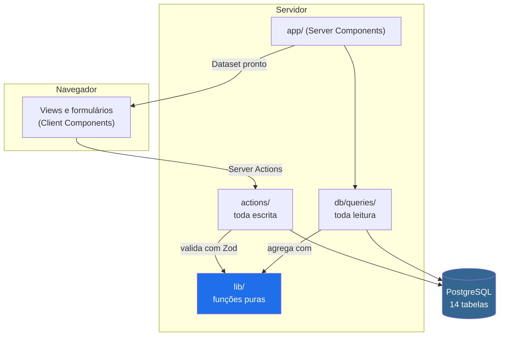

# airdrop-tracker

[](https://github.com/arturnery/airdrop-tracker/actions/workflows/ci.yml)


Controle financeiro para quem farma airdrops em várias carteiras ao mesmo tempo: quanto foi
aportado, o que precisa ser feito hoje e qual o resultado real, por projeto e por conta.

Substitui uma planilha onde depósito e saldo dividiam a mesma coluna. Isso parece um
detalhe de organização e não é: torna **todo somatório incorreto**, porque somar um aporte
de US$ 100 com uma leitura de saldo de US$ 103 produz US$ 203 de nada. Separar fluxo de
caixa de foto de saldo é a decisão central do modelo de dados, e é dela que sai o resto do
projeto.

> **Trabalho freelancer para a [Level Cripto](https://www.levelcripto.com.br)**, segundo
> projeto entregue para o mesmo cliente, depois da landing page da plataforma. A ferramenta
> nasceu de uma necessidade concreta da comunidade, e é usada por ela: por isso o cadastro
> tem aprovação manual e cada assinante enxerga apenas os próprios dados.

## Testar sem instalar nada

**[Abrir a aplicação](https://airdrop-tracker-arturnery97-1755s-projects.vercel.app)** e entrar com:

```
e-mail: demo@airdrop-tracker.app
senha:  demo1234
```

A conta já vem com projetos, lançamentos e tarefas de exemplo. Pode criar, editar e excluir
à vontade: os dados são fictícios e ficam isolados dessa conta.

Só duas coisas ficam travadas nela, nome e senha, porque valem para todo mundo que entra
pelo mesmo login. Cadastros novos entram numa fila de aprovação manual.

## Demonstração

`[ADICIONAR AQUI: screenshot da visão geral]`

`[ADICIONAR AQUI: GIF do fluxo de lançamento ou da aba do projeto]`

## Funcionalidades

- **Livro-razão por projeto e conta.** Aportes, rendimentos, retiradas e taxas como
  lançamentos datados. Não existe registro de saldo: o saldo é resultado, não entrada.
- **Aportes em token com cotação manual.** Registrar "1 SOL a US$ 50" e atualizar a cotação
  depois mostra quanto do resultado veio do farming e quanto veio do preço do token.
- **Programas de pontos.** Medições periódicas por projeto e conta, com evolução entre
  medições, para os projetos que distribuem por pontuação em vez de volume.
- **Tarefas recorrentes.** Diária, semanal, mensal ou a cada N dias, expandidas por conta,
  com conclusão em um clique e destaque para o que está atrasado. As ocorrências são
  calculadas na leitura, sem cron: um job que não roda deixa o dia sem tarefas em silêncio,
  e recalcular não tem estado a perder.
- **Metas e recebimentos.** Objetivos por projeto, com progresso derivado dos lançamentos,
  e registro dos airdrops efetivamente recebidos.
- **Múltiplos usuários com aprovação manual.** Cadastro livre, entrada só depois de
  liberada. Cada pessoa enxerga exclusivamente os próprios dados.

## Stack

| Camada | Escolha | Versão |
|---|---|---|
| Framework | Next.js (App Router, Server Components, Server Actions) | 16.2 |
| UI | React | 19.2 |
| Linguagem | TypeScript, modo `strict` | 5 |
| Banco | PostgreSQL serverless (Neon) | |
| ORM | Drizzle | 0.45 |
| Validação | Zod | 4.4 |
| Autenticação | Auth.js (next-auth), Credentials + JWT | 5 |
| Estilo | Tailwind CSS + shadcn/ui (Radix) | 4 |
| Gráficos | Recharts | 3.10 |
| Testes | Vitest | 4.1 |
| Hospedagem | Vercel | |

## Arquitetura

Três fronteiras, cada uma com um mecanismo que a torna difícil de furar sem querer.



1. **Nenhum componente fala com o ORM.** Leitura passa por `db/queries`, escrita por
   `actions/`. A regra é convenção, mas a próxima não é.
2. **Todo arquivo em `db/` começa com `import "server-only"`.** Um import acidental no
   cliente vira erro de build, em vez de vazar a string de conexão no bundle enviado ao
   navegador. Convenção que o compilador cobra.
3. **`lib/` não conhece a origem dos dados.** São funções puras de `(Dataset, ...) => X`.
   Isso soa acadêmico até render (ver os trade-offs abaixo).

## Decisões técnicas e trade-offs

### Dinheiro em inteiros, nunca em ponto flutuante

Valores são inteiros de centavos. `0.1 + 0.2 !== 0.3` em IEEE 754, e num sistema que soma
dezenas de lançamentos por conta o erro acumula até aparecer na tela. O `numeric` do
Postgres volta como string pelo Drizzle, o que é chato de manipular e é exatamente o
comportamento correto: obriga a conversão explícita em vez de deixar o JavaScript decidir.

**Trade-off:** toda entrada e saída precisa de conversão. Custa código repetitivo em
`lib/money.ts`, coberto por testes, e elimina uma classe inteira de bug silencioso.

### ROI sobre o capital parado, não sobre o total depositado

O denominador do retorno é o que está depositado **agora** (depósitos menos retiradas), não
a soma histórica dos depósitos. O motivo é a reciclagem de capital: usar os mesmos $50 em
dois projetos somaria $100 de base e derrubaria o percentual pela metade, sem nunca ter
havido mais de $50 imobilizados.

O capital nunca fica negativo, e isso não é detalhe de exibição. Depositar 50, render 10 e
sacar 60 deixaria o líquido em -10 com um lucro de +10, e `10 ÷ -10` mostraria **-100%**
para quem teve ganho. Base menor ou igual a zero devolve `null`, e a tela exibe só o
resultado em dólar: sem capital parado não existe retorno sobre capital, existe ganho
absoluto.

### Pontos são um tipo separado de dinheiro

Pontos usam inteiros escalados por 10⁴ e **não compartilham tipo com valores monetários**,
mesmo sendo os dois "números com casas decimais". Unificar economizaria código e permitiria
somar pontos com dólares sem que nada reclamasse. A separação é o ponto: o compilador
recusa a operação que não faz sentido no domínio.

### O banco recusa dados impossíveis, a aplicação não é a única guarda

Regras que estavam em código migraram para onde é mais difícil burlá-las:

| Regra | Como é garantida |
|---|---|
| Excluir projeto leva lançamentos, tarefas e metas | `ON DELETE CASCADE` |
| Uma medição de pontos por dia | `UNIQUE` + `ON CONFLICT` |
| Movimento exige par projeto×conta válido | Chave estrangeira **composta** |

A FK composta foi testada tentando inserir um lançamento órfão: o banco rejeitou. Validação
na aplicação vale para o que a aplicação escreve; a do banco vale também para o script, o
console e o engano.

### Sessão em JWT, e o que isso custou

Sem tabela de sessões: o token carrega `id` e `role`, o que mantém a autorização barata em
serverless (nenhuma consulta por requisição). O custo apareceu em uso real: **tudo que está
no token congela no login**. Trocar o nome no perfil salvava no banco e a barra lateral
seguia com o antigo.

A correção não foi reemitir o token, e sim separar duas coisas que estavam juntas:
identidade (`id`, `role`) continua vindo do token assinado, e o que é apenas exibição passa
a vir do banco. Reemitir resolveria o sintoma e deixaria a mesma armadilha para o próximo
campo editável.

### Uma conta pública que não vira um problema

Publicar credenciais num README costuma dar errado de três jeitos, e cada um pedia uma
resposta diferente:

| Risco | Resposta |
|---|---|
| Alguém troca a senha e tranca os visitantes seguintes | `is_demo` bloqueia a troca **no servidor**, não escondendo o botão |
| Alguém renomeia a conta para algo que o próximo visitante lê | Mesma trava, pelo mesmo motivo |
| A conta enxerga dados de terceiros | Papel `membro`, nunca `admin`: a fila de aprovação tem e-mails de outras pessoas |

O isolamento por usuário, que já existia, faz o resto: a conta pública vê apenas os
próprios dados, e nenhum dado real de quem mantém o projeto.

`is_demo` é uma coluna e não um valor de `role` de propósito. Um terceiro papel obrigaria a
revisar toda comparação de papel no sistema para decidir o que "demo" significa em cada
uma; a coluna deixa a autorização como estava e liga só o que precisa mudar.

A trava vive na Server Action, não no componente. Esconder o formulário no cliente não
impede a requisição direta à ação, que é o caminho que alguém realmente tentaria.

### Login que não revela quem tem conta

Senha errada, e-mail inexistente e conta não aprovada devolvem **a mesma recusa**.
Distinguir os casos transformaria a tela num verificador de quem tem cadastro. A senha é
processada mesmo quando o usuário não existe, porque responder rápido nesse caso revelaria
a mesma informação pelo tempo de resposta.

Uma exceção deliberada: o **cadastro** informa que o e-mail já existe. Isso confirma a
existência da conta, e foi escolhido mesmo assim: sem esse aviso a pessoa preenche o
formulário de novo achando que errou algo. Decisão consciente, não descuido.

### Funções puras que pagaram duas vezes

`lib/selectors.ts` e `lib/mutations.ts` recebem um `Dataset` e devolvem outro, sem saber de
onde os dados vieram. O retorno veio em dois momentos que não estavam planejados:

- **Trocar fixtures em memória por PostgreSQL não alterou nenhuma view, nenhum seletor e
  nenhum teste.** O único arquivo já existente que precisou mudar foi `app/layout.tsx`, que
  passou a montar o `Dataset` a partir do banco. Todo o resto do commit é código novo (a
  camada de leitura e o seed). Verificável em `git show --stat 7c3c776`.
- **A atualização otimista reusou a mesma função sem uma linha de alteração.** Quando
  marcar tarefa ficou lento, `useOptimistic` precisava de uma transformação local do
  estado. `alternarOcorrencia`, escrita quando os dados ainda eram locais, servia
  exatamente para isso.

**Trade-off:** manter `lib/` ignorante da origem dos dados exige montar o `Dataset` inteiro
e passá-lo adiante, o que é mais verboso que consultar o banco direto no componente. O
projeto é pequeno o bastante para isso caber; num volume maior, a agregação precisaria ir
para o banco.

### Entrada manual, sem leitura on-chain

Nada de RPC, API de exchange ou cotação automática. Um farmer opera em várias redes e
exchanges, e cada integração é um ponto de falha que envelhece sozinho. A entrada manual é
mais trabalhosa e mantém o sistema funcionando sem depender de nada externo.

### Dois bancos, escolhidos por argumento

Produção e desenvolvimento são branches distintos do mesmo projeto Neon. Desenvolvimento
**não** recebe cópia de produção: quando houver mais gente usando, produção guardará
e-mails e hashes de senha de terceiros, e clonar isso para onde se testa migração
espalharia dado de outra pessoa sem que ela tenha concordado.

Scripts administrativos escolhem o alvo por argumento (`--producao`), nunca editando
arquivo. Trocar conexão editando `.env.local` faz a operação mais perigosa do sistema
depender de lembrar de reverter um arquivo: basta esquecer uma vez.

**Não existe branch `dev`, e isso é deliberado.** Separar por branch resolve problemas de
trabalho simultâneo: revisar o código de outra pessoa antes de produção, segurar uma
entrega enquanto outra é corrigida. Com um desenvolvedor só, nenhum desses existe, e o
ganho restante seria abrir o sistema em outro aparelho. O que não se abriu mão foi da
separação de **dados**: banco de produção e de desenvolvimento são distintos desde o
começo. Branch organiza trabalho, banco separado protege dado; só o segundo é inegociável
sozinho. A decisão está registrada com o custo assumido e o gatilho para revê-la em
[`ARCHITECTURE.md` §11.1](ARCHITECTURE.md).

## Como rodar localmente

### Pré-requisitos

- Node.js 20 ou superior
- Uma conta no [Neon](https://neon.tech) (o plano gratuito basta)

### Instalação

```bash
git clone https://github.com/arturnery/airdrop-tracker.git
cd airdrop-tracker
npm install
```

### Variáveis de ambiente

```bash
cp .env.example .env.local
```

| Variável | O que é | Como obter |
|---|---|---|
| `DATABASE_URL` | Conexão do Postgres | Neon → Project → Connection Details (use a URL *pooled*) |
| `AUTH_SECRET` | Assina os tokens de sessão | `openssl rand -base64 32` |
| `ADMIN_EMAIL` | E-mail que nasce administrador | O seu |

### Banco e primeiro acesso

```bash
npm run db:migrate      # cria as 14 tabelas
npm run db:seed-demo    # opcional: dados fictícios para explorar
npm run dev             # http://localhost:3000
```

Cadastre-se em `/criar-conta` usando o mesmo e-mail de `ADMIN_EMAIL`: essa conta nasce
administradora e já aprovada. Qualquer outro e-mail entra na fila de aprovação, liberada em
`/membros`.

Nenhuma senha é definida por variável de ambiente ou linha de comando: ela iria parar no
histórico do shell.

### Scripts

| Comando | O que faz |
|---|---|
| `npm run dev` | Servidor de desenvolvimento |
| `npm run build` | Build de produção |
| `npm run db:generate` | Gera uma migração a partir do schema |
| `npm run db:migrate` | Aplica as migrações |
| `npm run db:studio` | Drizzle Studio |
| `npm run db:seed` | Cria a conta de administrador sem senha |
| `npm run db:seed-demo` | Carrega dados de demonstração |
| `npx tsx scripts/limpar-dados.ts` | Relata o que uma limpeza apagaria, preservando as contas de acesso |

Scripts que tocam o banco rodam contra desenvolvimento por padrão e anunciam o alvo antes
de agir. Produção exige `--producao` explícito, e alterações destrutivas exigem também
`--confirmar`:

```bash
npx tsx scripts/limpar-dados.ts                          # dev, só relata
npx tsx scripts/limpar-dados.ts --confirmar              # dev, apaga
npx tsx scripts/limpar-dados.ts --producao --confirmar   # produção, apaga
```

## Testes

```bash
npm test              # 189 testes
npm run test:watch    # modo observação
npm run check         # typecheck sem emitir
npm run lint
```

As quatro verificações mais o build rodam sozinhas no GitHub Actions a cada push e a cada
pull request ([`.github/workflows/ci.yml`](.github/workflows/ci.yml)). O build entra na
verificação com variáveis de ambiente falsas de propósito: todas as rotas são dinâmicas,
então nada consulta o banco durante o build, e uma conexão real daria ao CI acesso a dados
de produção sem necessidade.

Os testes cobrem o que quebra em silêncio: aritmética monetária e de pontos, agregação
financeira, seletores, mutações, regras de validação e o alvo de ocorrências das tarefas.
Componentes de interface não têm teste automatizado, o que é uma lacuna consciente e está
no roadmap.

Vários testes existem porque um bug aconteceu, e ficam como especificação executável do
caso. Exemplos: o parser recusando `"1.2.3,4,5"`, a decisão documentada de tratar `"10.005"`
como milhar, e schemas de transformação não sendo idempotentes.

## Estrutura de pastas

```
app/              Rotas. Server Components por padrão
  (app)/          Área autenticada: layout com sessão e navegação
  entrar/         Login, cadastro, recuperação, espera por aprovação
actions/          Server Actions: toda escrita passa por aqui
db/
  schema.ts       14 tabelas (Drizzle), com cascatas e FK composta
  queries/        Toda leitura e agregação
lib/              Funções puras, testáveis sem banco
  money.ts        Aritmética monetária em centavos
  points.ts       Pontos em inteiros escalados
  finance.ts      Fórmulas de resultado e exposição
  recurrence.ts   Datas devidas de uma tarefa recorrente
  selectors.ts    Derivações do Dataset para as telas
  mutations.ts    Transformações puras (também usadas na UI otimista)
  validators.ts   Schemas Zod, compartilhados entre cliente e servidor
components/
  views/          Telas
  forms/          Diálogos e campos
  ui/             shadcn/ui
scripts/          Seed, limpeza e reparos, com escolha de ambiente
tests/            Vitest
```

## Roadmap

- [ ] **Importação da planilha por CSV.** A tela existe e explica o mapeamento de cada
      coluna, mas o processamento não: falta o parser, a prévia e a gravação transacional.
      Desenhado em [`ARCHITECTURE.md` §7](ARCHITECTURE.md)

- [ ] **Idioma selecionável (português e inglês).** Hoje a interface é só em português e os
      valores saem no formato de dólar americano (`$1,234.56`). A escolha de idioma levaria
      junto o formato de data, o separador de milhar e a apresentação da moeda, porque são
      a mesma decisão vista de ângulos diferentes. Enquanto isso não existe, os campos de
      data e de valor confirmam embaixo como o dado foi interpretado

- [ ] **Catálogo de projetos da comunidade.** Quem administra cadastra o projeto uma vez,
      com links e data prevista de TGE, e quem farma o adiciona aos próprios com um clique,
      em vez de recadastrar tudo do zero. Modelado em
      [`ARCHITECTURE.md` §13](ARCHITECTURE.md): adoção por cópia, para que o projeto passe
      a ser de quem adotou e nenhuma ação de quem administra alcance dados de terceiros
- [ ] Testes de componente e um teste de ponta a ponta do fluxo de lançamento
- [ ] Edição de metas, recebimentos e medições (hoje só criar e excluir)
- [ ] Alternância entre tema claro e escuro (o tema claro já existe, falta o controle)
- [ ] Redefinição de senha pela área de administração, gerando senha temporária. Para uma
      comunidade fechada com aprovação manual, e-mail transacional é infraestrutura demais
      para o problema: a tela de recuperação existe, mas o provedor de envio não se paga
- [ ] Criar o vínculo projeto×conta junto com o projeto, em vez de no primeiro lançamento

## O que aprendi

**Falhar em silêncio é pior que falhar.** Criar tarefa com o campo de conta em branco
resolvia o alvo como lista vazia e um `if` pulava a inserção sem reclamar. A tarefa ia para
o banco sem nenhuma ocorrência, e como a tela lista ocorrências, ela não aparecia em lugar
nenhum: nem para ser apagada. Cinco delas acumularam antes de alguém notar. Hoje o caso
recusa com mensagem. O bug não estava no `if`, estava em ter escolhido não avisar.

**Testabilidade não é sobre cobertura, é sobre onde o código mora.** A regra que causou o
bug acima vivia dentro de uma Server Action, e testá-la exigiria um banco de verdade. Por
isso não tinha teste. Movida para uma função pura, ganhou seis casos em minutos. Código
difícil de testar costuma estar no lugar errado, não faltando teste.

**Arquitetura se paga em mudanças que não foram previstas.** Manter `lib/` ignorante da
origem dos dados parecia rigor desnecessário enquanto tudo era fixture. Rendeu duas vezes:
na troca por PostgreSQL (um arquivo) e na atualização otimista, que reusou uma função escrita
meses antes para outro fim. Nenhum dos dois estava no plano quando a decisão foi tomada.

**Validação de ambiente precisa envelhecer junto com o projeto.** `lib/env.ts` recusava
subir sem `SEED_USER_ID`, variável que existia para fixar um dono antes de haver login. Com
autenticação real ela virou obsoleta, mas continuou obrigatória, e quase impediu o primeiro
deploy. A guarda estava protegendo a aplicação de uma variável que a aplicação não lia.

**Transformações do Zod não são idempotentes.** Validar no cliente, enviar o resultado
transformado e revalidar no servidor produz "expected string, received number", porque a
segunda passada recebe o que a primeira já converteu. A correção foi enviar o objeto bruto.
Sete testes agora fixam esse comportamento.

**Escolha de tecnologia com critério declarado.** Next.js atendia ao que o projeto pedia:
renderização no servidor para telas com muito cálculo, Server Actions em vez de uma API
separada para um time de uma pessoa, e deploy simples na Vercel. Entre as opções que
resolviam isso igualmente bem, o desempate foi meu: era a que eu tinha no currículo sem
nenhum projeto que comprovasse. Registro isso porque decisão técnica raramente tem um único
critério, e fingir que tem é o que produz justificativa inventada depois do fato.

## Documentação

| Documento | Conteúdo |
|---|---|
| [`ARCHITECTURE.md`](ARCHITECTURE.md) | Modelo de dados, fórmulas financeiras, motor de recorrência, autorização |
| [`DEVLOG.md`](DEVLOG.md) | Como se chegou aqui: alternativas descartadas, trade-offs e os bugs do caminho |

## Licença

[MIT](LICENSE).

## Contato

**Artur Matoso Nery**, desenvolvedor Full Stack

Projeto entregue como freelancer para a [Level Cripto](https://www.levelcripto.com.br),
para quem também desenvolvi a landing page da plataforma. Disponível para novos projetos e
oportunidades.

- Portfólio: [arturnery.vercel.app](https://arturnery.vercel.app/)
- LinkedIn: [artur-matoso-nery](https://www.linkedin.com/in/artur-matoso-nery-84a4971a9/)
- GitHub: [github.com/arturnery](https://github.com/arturnery)
- E-mail: arturnery1997@gmail.com
